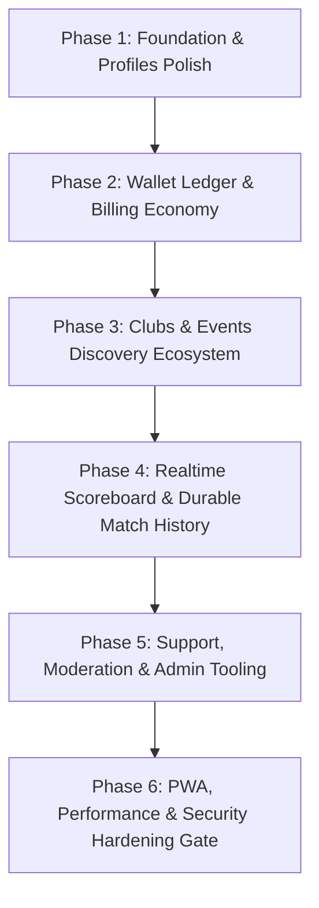

# Rallies – MVP Roadmap & Implementation Blueprint

This document defines the official **Minimum Viable Product (MVP) Roadmap and Implementation Blueprint** for Rallies, synthesized directly from the product scope (`docs/01-product-scope.md`), architectural style (`docs/02-architecture.md`), technical standards (`docs/03-tech-stack.md` to `12-localization-and-i18n.md`), and senior architectural directives (`docs/project-definition.txt`).

---

## 1. Executive Summary & Core Philosophy

Rallies is a multilingual, high-performance, security-first web platform tailored for the table tennis ecosystem (players, clubs, event organizers, and administrators).

### Core Architectural & Engineering Pillars
1. **Modular Monolith**: Organized strictly by **business capability** (`identity`, `profiles`, `clubs`, `events`, `scoreboard`, `wallet`, `billing`, `support`, `admin`), not by technical layer. This structure ensures high delivery speed and consistency while remaining ready for future extraction into services if scale demands it.
2. **Schema-First & Type-Safe**: Every API contract is defined first using **Zod** and `fastify-type-provider-zod`. OpenAPI (`@fastify/swagger`) is treated as a binding contract artifact.
3. **Ledger-First Financial Integrity**: Credit and coin balances are derived from immutable `LedgerEntry` records. Balances and purchase entitlements are **never** trusted from the client and are verified via server-side idempotency keys and Stripe webhooks.
4. **Separation of Ephemeral vs. Durable State**: Realtime scoreboard point-tracking (`ScoreboardSession`) is low-latency and ephemeral (Redis/Socket rooms). Match history (`Match`) is durable and persisted to PostgreSQL only when explicitly finalized.
5. **Security by Default (OWASP ASVS Level 2)**: Strict input validation, strict separation of authentication and authorization, Content Security Policy (CSP), rate limiting, and comprehensive audit logging for financial and privileged actions.
6. **Locale-Aware, Language-Neutral Domain**: Supported locales (`en` and `pt-BR`) are handled at the presentation and notification layers. System enums, statuses, and domain logic remain strictly language-neutral (`English` fallback).

---

## 2. Current Status & Gap Analysis

### ✅ Completed Foundation & Baseline
- **Monorepo Workspace**: Configured with `pnpm`, Docker Compose (`db:up`), and structured `backend/` and `frontend/` packages.
- **Database Schema**: Full PostgreSQL schema defined in `backend/prisma/schema.prisma` (`v1` migration executed), covering `User`, `Profile`, `Club`, `ClubMember`, `Event`, `ScoreboardSession`, `Match`, `Wallet`, `LedgerEntry`, and `SupportTicket`.
- **Core Infrastructure**: Fastify API server with structured logging (`Pino`), error handling, health checks, and OpenAPI generation (`@fastify/swagger`).
- **Core Identity (`identity`) & Webhooks (`webhooks`)**: Internal identity management, provider linkage (`Clerk`), role definitions (`USER`, `CLUB_ADMIN`, `EVENT_MANAGER`, `PLATFORM_ADMIN`), and Clerk webhook synchronization routes (`/api/v1/webhooks/clerk`).
- **Profiles (`profiles`) Layer**: Structured domain layer ready for completion with repository, schema, service, controller, and routes (`/api/v1/profiles`).
- **Frontend App Shell**: Next.js App Router structured with `next-intl` localization layout (`[locale]`), routing groups `(marketing)` and `(app)` (`/app`, `/clubs`, `/events`, `/profiles`).

---

## 3. Phased MVP Roadmap & Task Importance

To deliver a high-value MVP safely and efficiently, implementation follows a strict sequence governed by **dependency order** and **risk mitigation**. Each phase must pass automated verification gates before proceeding.



### Phase 1: Profiles Polish & Public Presence
**Objective**: Finalize public player identity and ensure seamless onboarding from authentication to localized public profiles.
* **Backend (`profiles`)**:
  - Complete `profiles.repository.ts`, `profiles.service.ts`, `profiles.controller.ts`, and `profiles.routes.ts`.
  - Implement endpoints: `GET /api/v1/profiles/:slug` (public view with privacy settings applied), `PUT /api/v1/profiles/me` (update sport metadata, bio, location, visibility).
  - Enforce location privacy: expose only `city`, `state/region`, and `country` by default.
* **Frontend (`/profiles`)**:
  - Profile setup flow post-signup.
  - Server-rendered public profile page (`/profiles/[slug]`) optimized for SEO and fast loading.
* **Verification Gate**:
  - Integration tests verifying profile updates, slug uniqueness, and location privacy masking.
  - E2E test: User signup $\rightarrow$ profile setup $\rightarrow$ public profile page rendering.

---

### Phase 2: Credit Economy, Wallet Ledger & Stripe Billing
**Objective**: Establish the financial engine **before** building paid community features, ensuring credit consumption hooks are available from day one.
* **Backend (`wallet`)**:
  - Implement `wallet` module strictly following the **immutable ledger** principle (`wallet.repository.ts`, `wallet.service.ts`).
  - Core operations: `createWallet`, `getBalance` (projected from `LedgerEntry`), and `consumeCredits(userId, amount, reason, idempotencyKey)`.
  - Enforce transactional safety and idempotency in PostgreSQL via Prisma interactive transactions (`$transaction`).
* **Backend (`billing`)**:
  - Stripe integration (`billing.service.ts`, `billing.controller.ts`) for credit packages and monthly recurring subscriptions.
  - Webhook verification endpoint (`/api/v1/webhooks/stripe`) verifying signatures (`stripe-signature`) and processing `checkout.session.completed` and `invoice.paid` events.
  - Automatic credit allocation via `wallet.service.ts` upon verified payment events.
* **Frontend (`/wallet` & Billing UI)**:
  - Wallet balance display in the app shell header.
  - Credit purchase modal/page with Stripe Checkout redirection and subscription cost-benefit tier display.
* **Verification Gate**:
  - Unit tests for wallet balance calculations, concurrency/race-condition handling, and idempotency guarantees.
  - Integration tests mocking Stripe webhooks to verify atomic ledger credit creation.

---

### Phase 3: Clubs & Events Ecosystem (Network Effect & Discovery)
**Objective**: Deliver the core marketplace and community structures that drive user engagement and monetize the platform.
* **Backend (`clubs`)**:
  - Club creation workflow consuming credits via application contract (`wallet.service.consumeCredits`).
  - Membership lifecycle management: `INVITED` $\rightarrow$ `REQUESTED` $\rightarrow$ `ACTIVE` $\rightarrow$ `REMOVED`.
  - Role authorization checks: `OWNER`, `ADMIN`, `MEMBER`.
  - Endpoints: `POST /api/v1/clubs`, `GET /api/v1/clubs` (with location and name filters), `POST /api/v1/clubs/:id/members`, `PUT /api/v1/clubs/:id/members/:userId`.
* **Backend (`events`)**:
  - Event draft and publication lifecycle (`DRAFT`, `PUBLISHED`, `CANCELLED`, `ARCHIVED`).
  - Credit consumption hooks: creating an event and boosting/promoting an event (`boost status`).
  - Discovery search and filtering engine: query by `location`, `city`, `title`, and `status`.
* **Frontend (`/clubs` & `/events`)**:
  - Localized discovery listing pages with dynamic search filters.
  - Club details page displaying member rosters, roles, and join/leave buttons.
  - Event management dashboard for organizers and public tournament advertisement view for players.
* **Verification Gate**:
  - Unit & integration tests for club role permissions and event publication/boosting eligibility.
  - E2E test: Club creation (credit deduction check) $\rightarrow$ member invitation $\rightarrow$ event publication and discovery filter test.

---

### Phase 4: Scoreboard Engine (Realtime vs. Durable History)
**Objective**: Implement the signature interactive scoreboard with strict separation between ephemeral session rooms and permanent match history.
* **Backend (`scoreboard` - Ephemeral State)**:
  - Realtime gateway using low-overhead WebSocket / Socket.IO (or Fastify WebSocket plugin paired with Redis/memory-backed room state).
  - Room authorization: Private sessions (`ScoreboardSessionStatus.LIVE`) stay strictly accessible only to the creator unless shared via broadcast link.
  - Broadcast extension: Consuming credits to unlock expanded broadcast viewer limits or public tournament streaming.
* **Backend (`scoreboard` - Durable History)**:
  - Save-to-history flow (`POST /api/v1/scoreboard/:id/finish`): converts transient score data into an immutable `Match` entity (`MatchStatus.FINISHED`).
  - Match association: link score snapshots to 2 profiles (`SINGLES`) or 4 profiles (`DOUBLES`).
* **Frontend (`/scoreboard`)**:
  - Mobile-first, highly responsive interactive scoreboard interface with touch-friendly point tracking (`+1`, `-1`, server rotation, timeout tracking).
  - Broadcast spectator view (`/scoreboard/watch/:id`) with real-time state synchronization.
  - Match history log on user and club profiles.
* **Verification Gate**:
  - Unit tests verifying ping pong scoring transitions (deuce rules, set victories, serve alternations).
  - Integration tests ensuring that point updates do not write to PostgreSQL (`Match` table) until explicit finish action is triggered.

---

### Phase 5: Support, Moderation & Operational Tooling
**Objective**: Provide essential customer support loops and administrative controls to manage platform safety and dispute handling.
* **Backend (`support` & `admin`)**:
  - Ticket submission (`SupportTicketType.SUPPORT`, `FEEDBACK`, `SUGGESTION`) with status lifecycle (`OPEN`, `IN_PROGRESS`, `ANSWERED`, `CLOSED`).
  - Admin operational endpoints (`/api/v1/admin/*`): protected by `PLATFORM_ADMIN` role checks.
  - Moderation tools: ability to archive non-compliant clubs/events, manage support tickets, and view financial/audit logs.
* **Frontend (`/support` & Admin Dashboard)**:
  - User-facing contact and feedback form.
  - Internal admin dashboard view for ticket triage and moderation actions.
* **Verification Gate**:
  - Integration tests verifying RBAC (`PLATFORM_ADMIN` enforcement) across all admin routes.

---

### Phase 6: PWA Readiness, Performance & Security Hardening Gate
**Objective**: Prepare the platform for production launch by fulfilling non-functional targets and OWASP ASVS Level 2 requirements.
* **PWA & Mobile Shell**:
  - Integrate **Serwist** (`@serwist/next`) to manage service worker registration, offline shell caching, and PWA manifest (`manifest.json`) targeting native mobile feel.
* **Performance Hardening**:
  - Verify server-side rendering and CDN/edge caching strategies for public pages (`/profiles/[slug]`, `/events`).
  - Audit Prisma query patterns to eliminate N+1 queries and fine-tune database connection pooling (`@prisma/client` / pool configuration).
* **Security & Audit Gate (OWASP ASVS Level 2 Check)**:
  - **Content Security Policy (CSP)**: Configure strict CSP headers (`X-Frame-Options: DENY`, `Referrer-Policy: strict-origin-when-cross-origin`, `Strict-Transport-Security`, `Permissions-Policy`) in `next.config.ts` and `middleware.ts`.
  - **Rate Limiting**: Apply `@fastify/rate-limit` on authentication, webhook, and credit-sensitive endpoints.
  - **Audit Logging**: Verify that all wallet debits, credits, role adjustments, and match history edits emit traceable structured audit entries.
* **Verification Gate**:
  - Run full suite of E2E Playwright tests across all 6 phases.
  - Execute automated dependency vulnerability scanning and secret scanning.

---

## 4. Implementation Rules & AI Agent Directives

To maintain architecture integrity throughout AI-assisted development (using Codex or Antigravity agents), the following rules must be strictly adhered to:

### Modular Monolith Standard
```
backend/src/modules/<module-name>/
├── <module>.types.ts         # Internal types, repository contracts, enums
├── <module>.schemas.ts       # Zod schemas for external API request/response validation
├── <module>.repository.ts    # Prisma database persistence access
├── <module>.service.ts       # Core domain business logic and orchestration
├── <module>.controller.ts    # Fastify route handlers delegating to service layer
└── <module>.routes.ts        # Fastify route registration and OpenAPI contract linking
```

### Mandatory Engineering Commandments
1. **Schema Before Route**: Never implement a route handler or controller without first defining exact Zod schemas in `<module>.schemas.ts`.
2. **No Prisma in Controllers**: Route handlers (`controller.ts`) must never call `prisma.*` directly. All data persistence must pass through `service.ts` and `repository.ts`.
3. **No Business Logic in Transport**: Controllers are strictly responsible for parsing input, delegating to the service layer, and formatting HTTP responses.
4. **No Generic Utility Dumps**: Never dump domain rules into generic `utils` files. Place business logic inside the appropriate domain module.
5. **Cross-Module Interaction**: Modules must communicate through explicit service contracts (`application/service` interfaces). Do not create tight coupling or direct repository access across domain boundaries.
6. **Language-Neutral Domain**: Never store or evaluate translated UI strings in business logic. All database statuses, enums, and system values must remain strictly language-neutral (`English`).
7. **Financial Auditability**: Never mutate wallet balances without creating a corresponding `LedgerEntry` and capturing an `idempotencyKey`.

---

## 5. Verification Checklist for Every Pull Request

Every feature or phase completion must satisfy the following checklist prior to merging to `main`:
- [ ] **Lockfile & Dependencies**: `pnpm-lock.yaml` is clean and enforced; no unauthorized dependencies introduced.
- [ ] **Type Checking & Linting**: `pnpm -r build` and TypeScript checks pass with zero errors.
- [ ] **Schema Contract Validity**: All API endpoints have explicit Zod request/response schemas registered with `@fastify/swagger`.
- [ ] **Test Coverage**:
  - Unit tests for domain rules, wallet calculations, and scoring logic.
  - Integration tests for repositories, routes, and authorization boundaries.
- [ ] **Security Review**:
  - No secrets logged or exposed.
  - Inputs validated against strict schemas.
  - Protected endpoints verify user identity and required roles (`USER`, `CLUB_ADMIN`, `EVENT_MANAGER`, `PLATFORM_ADMIN`).
- [ ] **Localization Check**: All user-facing text uses translation keys (`i18n/messages`); system enums are language-neutral.
